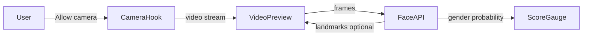

# Face Scan Web App (MVP)

## Architecture

Greenfield repo ([README.md](README.md) only today). Per [.cursorrules](.cursorrules), use **pnpm** for all package management.




All processing stays in the browser. No images leave the device.

## Tech stack


| Layer     | Choice                                  | Why                                                                                                                               |
| --------- | --------------------------------------- | --------------------------------------------------------------------------------------------------------------------------------- |
| Framework | React 18 + TypeScript                   | Standard SPA; good fit for camera UI state                                                                                        |
| Bundler   | Vite                                    | Fast dev server; works with pnpm                                                                                                  |
| Face ML   | `@vladmandic/1face-api`                 | Maintained fork of face-api.js; includes `GenderNet` (male/female probability) + face detection, runs on TensorFlow.js in-browser |
| Styling   | Plain CSS modules or a single `App.css` | MVP scope — no design-system overhead                                                                                             |


## User flow

1. **Landing** — Short copy + "Start scan" button
2. **Permission** — `navigator.mediaDevices.getUserMedia({ video: { facingMode: 'user' } })`
3. **Scanning** — Live `<video>` preview; load ML models (~5–10 MB) with a loading indicator
4. **Detection** — Run face detection each animation frame; when a face is stable for ~1 s, run gender classification once
5. **Result** — Show score on a horizontal gauge labeled **Masculine** ← → **Feminine**, plus "Scan again"

## Scoring approach

`GenderNet` returns probabilities (e.g. `{ male: 0.72, female: 0.28 }`). Map to a 0–100 scale:

```ts
feminineScore = Math.round(femaleProbability * 100)
// 0 = most masculine, 100 = most feminine
```

This is a **presentation estimate**, not biological fact. MVP includes one line of disclaimer copy under the result (e.g. "For entertainment only — results are approximate.").

No custom landmark heuristics in MVP — keeps the diff small and avoids arbitrary geometry rules.

## File structure to create

```
vibecode/
├── package.json          # pnpm scripts: dev, build, preview
├── vite.config.ts
├── tsconfig.json
├── index.html
├── public/
│   └── models/           # face-api weights (tiny_face_detector, face_landmark_68, gender_age)
└── src/
    ├── main.tsx
    ├── App.tsx           # step state machine: idle → scanning → result
    ├── App.css
    ├── hooks/
    │   ├── useCamera.ts          # getUserMedia, stream cleanup
    │   └── useFaceScanner.ts     # model load + rAF loop + stable-face gate
    ├── components/
    │   ├── CameraView.tsx        # <video> + optional landmark canvas overlay
    │   └── MasculineFeminineGauge.tsx
    └── lib/
        └── faceModels.ts         # load models from /models, wrap detect + classify
```

## Key implementation details

### Camera hook (`useCamera.ts`)

- Request front-facing camera; handle `NotAllowedError` / `NotFoundError` with user-visible messages
- Attach stream to `<video ref>` via `srcObject`
- Stop all tracks on unmount or retake

### Face scanner hook (`useFaceScanner.ts`)

- On mount: load models via `faceModels.ts` (show `loadingModels` state)
- After video is playing: `requestAnimationFrame` loop calling `faceapi.detectSingleFace(video, options).withFaceLandmarks().withAgeAndGender()`
- **Stable-face gate**: require face detected for N consecutive frames (~30 at 30 fps ≈ 1 s) before locking result — avoids flicker
- Return `{ status, score, error }`

### Model loading (`faceModels.ts`)

- Download model manifests into `[public/models/](public/models/)` (standard face-api model bundle: `tiny_face_detector`, `face_landmark_68_tiny`, `age_gender_model`)
- `faceapi.nets.*.loadFromUri('/models')` — served statically by Vite

### Gauge component

- Horizontal bar with a marker at `feminineScore%`
- Labels at left (Masculine) and right (Feminine)
- Display numeric score (e.g. "42 / 100")

### Requirements / constraints

- **Secure context**: camera works on `localhost` during dev; production needs HTTPS
- **First load**: model download adds a few seconds — show spinner + "Loading models…"
- **Browser support**: Chrome/Edge/Firefox/Safari (recent); mobile browsers supported with same flow

## What we are NOT building (MVP)

- Backend, database, or auth
- Image upload (camera only)
- Persistent history of scans
- Polished animations / onboarding wizard (per your scope choice)

## Verification

After implementation:

1. `pnpm install && pnpm dev`
2. Open `http://localhost:5173`, grant camera permission
3. Confirm: video preview → face outline/detection → score appears on gauge
4. "Scan again" resets and re-runs detection
5. `pnpm build` succeeds for static deploy (Vercel/Netlify/GitHub Pages)

## Optional follow-ups (out of scope)

- Landmark-based secondary signals blended with gender probability
- Canvas face mesh overlay for visual feedback during scan
- Deploy config + README setup instructions

