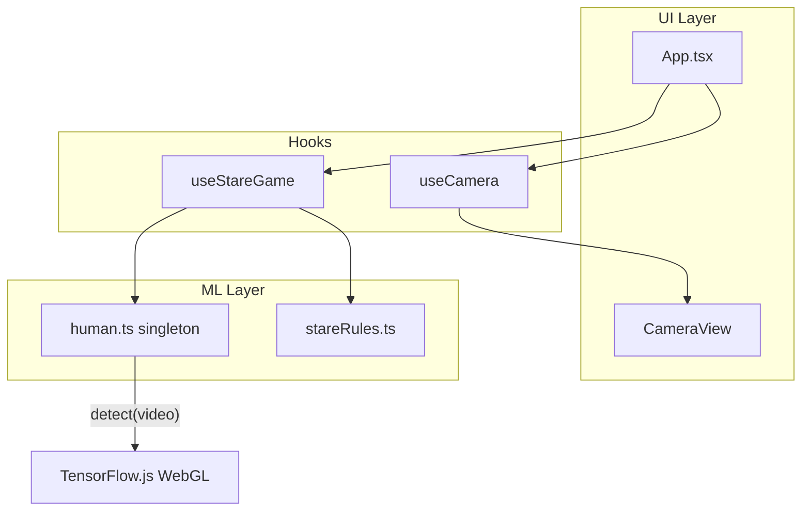

# Stare-off game migration plan

**Status:** Planned (not started)  
**Last updated:** 2026-06-06  
**Target library:** [@vladmandic/human](https://github.com/vladmandic/human)  
**Decision:** Refactor this repo in place (do not start a new project)

---

## Summary

Migrate from the current **face scan / masculine–feminine spectrum** app to a **solo stare-off game** powered by Human. The player keeps a serious face as long as possible; **smiling ends the round**. Camera, Vite, React, and Netlify deployment stay; face-api and gender-scan UI are removed.

---

## Current state

| Area | Today |
|------|--------|
| **Product** | Camera scan → stable face detection → gender score → spectrum gauge |
| **ML** | `@vladmandic/face-api` with weights in `public/models/` |
| **Flow** | `idle → scanning → result` in `src/App.tsx` |
| **Detection** | `src/lib/faceModels.ts` + `src/hooks/useFaceScanner.ts` |
| **UI** | Figma-styled layout; `MasculineFeminineGauge`, spectrum/teardrop assets |
| **Deploy** | Netlify (`netlify.toml`), HTTPS dev via `@vitejs/plugin-basic-ssl` |

---

## Target state

| Area | After migration |
|------|-----------------|
| **Product** | “Serious Face” solo endurance — hold a neutral face; timer runs until you smile |
| **ML** | `@vladmandic/human` with face detector + **emotion** (happy/smile) only |
| **Flow** | `idle → loading → calibrating → playing → lost → (play again)` |
| **Detection** | `src/lib/human.ts` + `src/hooks/useStareGame.ts` |
| **UI** | Timer, best score, lose screen; reuse camera frame + button styles from `App.css` |
| **Storage** | Personal best in `localStorage` (no backend) |

---

## Why refactor in place (not a new repo)

| Approach | Pros | Cons |
|----------|------|------|
| **Refactor in place** ✓ | Reuses working camera hook, Vite/HTTPS, React shell, Netlify config, Figma CSS | Git history mixes old + new concept; must delete dead code |
| **New project + copy** | Clean product name/history | Same migration effort **plus** re-scaffolding; only ~3 files copy cleanly |

**Copy as-is (or minor edits):**

- `src/hooks/useCamera.ts` — stream lifecycle, secure context, error messages
- `src/components/CameraView.tsx` — video element + optional progress
- `vite.config.ts`, `index.html`, TypeScript/React tooling, `netlify.toml`

**Remove (not needed for stare-off):**

- `src/lib/faceModels.ts`
- `src/hooks/useFaceScanner.ts`
- `src/components/MasculineFeminineGauge.tsx`
- `src/lib/spectrum.ts`, `src/lib/teardropGauge.ts`
- `public/models/*` (face-api weights)
- `public/design/*` (gauge assets tied to old results UI)

**Add:**

- `src/lib/human.ts` — Human singleton, config, load/warmup/detect helpers
- `src/lib/stareRules.ts` — thresholds, smile debounce, pure testable helpers
- `src/hooks/useStareGame.ts` — game state machine + RAF loop
- Updated `src/App.tsx` + results/timer UI

---

## Architecture



---

## Game design: “Serious Face”

Recommended v1 mode (entertaining, uses Human emotion API, matches smile = lose).

### Screens

1. **Idle** — Rules + Start
2. **Loading** — Human models loading
3. **Calibrate (2–3 s)** — Face must be in frame; copy: “Keep a straight face”
4. **Playing** — Live timer; optional funny prompts at 5 s / 10 s / 20 s
5. **Lost** — “You smiled!” + final time + personal best
6. **Play again**

### Win / lose rules (v1)

| Rule | Behavior |
|------|----------|
| **Smile (primary)** | `happy` emotion score above threshold for **N consecutive frames** → lose |
| **Face lost** | No face in frame → pause timer or forfeit (prevents leaving camera) |
| **Calibration** | Face present for ~15–30 frames before timer starts |

### Deferred (post-v1)

- Blink detection (iris / landmarks)
- Look-away / gaze off-camera
- Vs-AI opponent mode
- Multiplayer

---

## Technical migration

### Dependencies (`package.json`)

```diff
- "@vladmandic/face-api"
+ "@vladmandic/human"
  "@tensorflow/tfjs"   # keep — Human depends on it
```

Model assets: follow [Human installation](https://github.com/vladmandic/human) (bundle under `public/` or documented CDN). Remove face-api weights from `public/models/`.

### Human config (performance-first)

Only enable modules required for smile detection:

```ts
{
  backend: 'webgl',
  async: true,
  face: {
    enabled: true,
    detector: { enabled: true },
    mesh: { enabled: false },
    iris: { enabled: false },
    emotion: { enabled: true },
    description: { enabled: false },
  },
  body: { enabled: false },
  hand: { enabled: false },
  gesture: { enabled: false },
}
```

### `src/lib/human.ts` (sketch)

- `createHuman()` / `getHuman()` — singleton
- `loadHuman()` — `human.load()` + `human.warmup()`
- `detectFrame(video)` → `{ faceDetected, happyScore, emotions? }`

Read `result.face[0].emotion`, find entry with `emotion === 'happy'` (exact shape per Human types at implementation time).

### `src/hooks/useStareGame.ts` (sketch)

Mirror RAF pattern from current `useFaceScanner.ts`:

| State | Meaning |
|-------|---------|
| `loading_models` | Human loading |
| `calibrating` | Waiting for stable face |
| `playing` | Timer running |
| `lost` | Smile detected |
| `error` | Model or detection failure |

**Timer:** `performance.now()` delta while `playing`.  
**Smile debounce:** e.g. 5–10 consecutive frames above threshold (tune in `stareRules.ts`).  
**Best score:** `localStorage` key e.g. `stare-off-best-ms`.

### App changes

Replace `idle | scanning | result` in `src/App.tsx` with game states. Reuse `.camera-frame`, `.btn--scan`, header layout from `App.css`; update copy and results panel.

---

## Implementation phases

### Phase 1 — Library swap

- [ ] Install `@vladmandic/human`, remove `@vladmandic/face-api`
- [ ] Add `src/lib/human.ts` with minimal config
- [ ] Verify `human.detect(video)` in dev on desktop + mobile HTTPS
- [ ] Measure cold start / model load time

### Phase 2 — Game logic

- [ ] Add `src/lib/stareRules.ts` (thresholds, debounce helpers)
- [ ] Implement `src/hooks/useStareGame.ts`
- [ ] Persist best score in `localStorage`
- [ ] Optional: unit tests for pure rule helpers

### Phase 3 — UI + cleanup

- [ ] New screens: idle, playing (timer), lost
- [ ] Wire `App.tsx` to `useStareGame`
- [ ] Delete gender-scan components and face-api model files
- [ ] Update `README.md` and `index.html` title/copy

### Phase 4 — Polish (optional)

- [ ] Escalating on-screen prompts during long runs
- [ ] Debug overlay (`human.draw.face`) behind dev flag
- [ ] Threshold tuning UI or env-based constants
- [ ] Mobile QA on Netlify deploy

---

## Risks and mitigations

| Risk | Impact | Mitigation |
|------|--------|------------|
| Human models heavier than face-api | Slower first load, lower FPS | Disable unused modules; warmup; target 15–30 FPS |
| Emotion false positives | Lose while still neutral | Consecutive-frame debounce; calibration period; tunable threshold |
| Camera requires HTTPS | Broken on HTTP | Keep `basicSsl` in dev; Netlify serves HTTPS in prod |
| Smile-only may feel easy/hard | Poor game feel | Tune threshold; add prompts; defer blink/gaze if needed |

---

## Effort estimate

| Scope | Time |
|-------|------|
| Playable v1 (refactor in place) | ~1–2 days |
| New repo + same features | +2–4 hours scaffolding, no net savings |

---

## References

- [Human on GitHub](https://github.com/vladmandic/human)
- [Human demos](https://github.com/vladmandic/human/tree/main/demo) (including emotion / face)
- Current face-api integration: `src/lib/faceModels.ts`
- Current scan loop: `src/hooks/useFaceScanner.ts`

---

## Changelog (this document)

| Date | Change |
|------|--------|
| 2026-06-06 | Initial plan: Human migration, Serious Face game, refactor-in-place decision |
